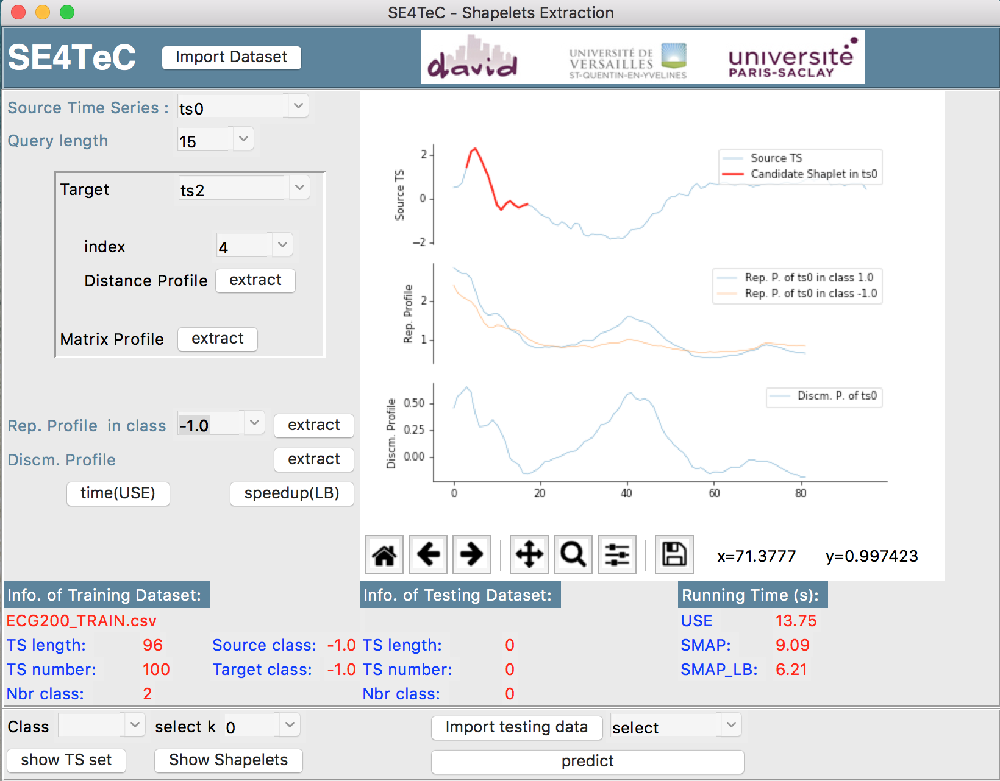
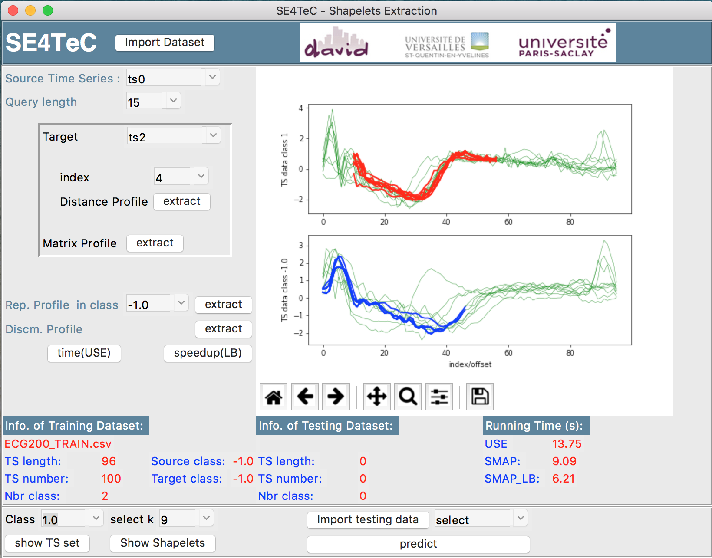
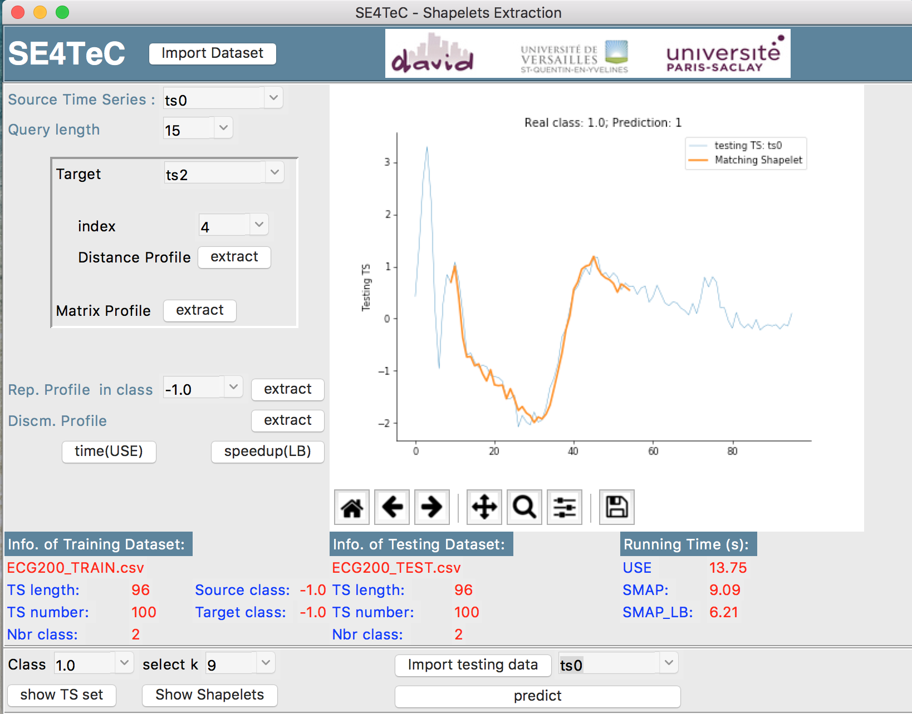
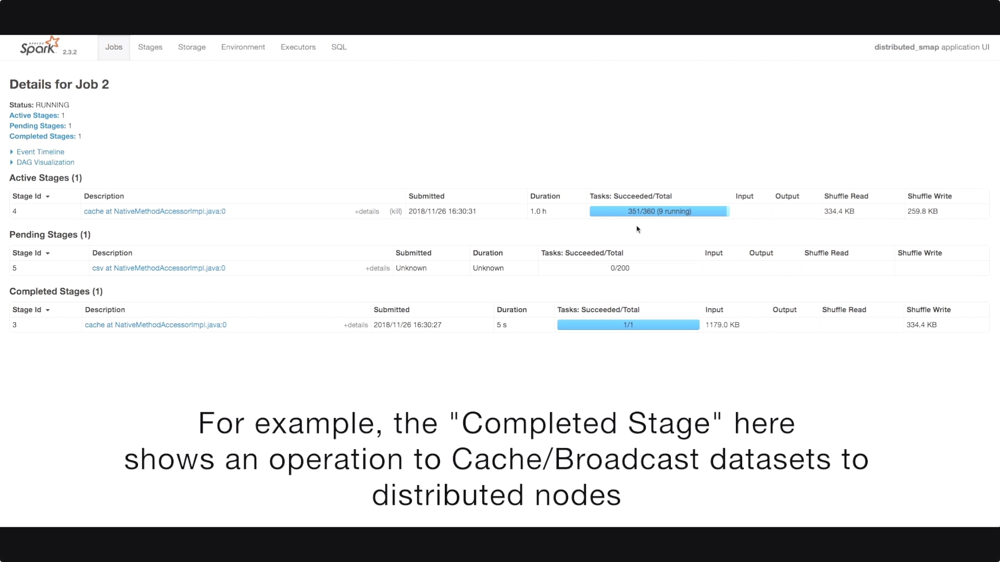
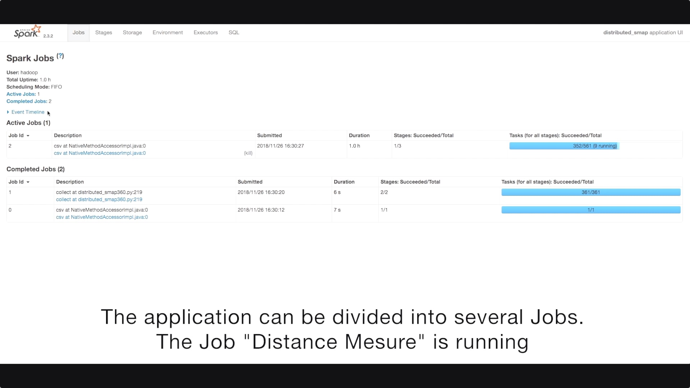

# SE4TeC
## A Scalable Engine for efficient and expressive Time Series Classification

<center>By Jingwei ZUO, Karine ZEITOUNI and Yehia TAHER.</center>

## Outline:

### 1. Cluster_Docker

As we utilize AWS EMR cluster during the test of the project, then we provide an 1-click Spark cluster, powered by Docker, to facilitate the users to simulate the program enviroment locally. The cluster contains the support of PySpark and common Python3 libraries used in this project. Users can modify flexibly the number of slave nodes inside the cluster, and update the support inside each machine instance. 

### 2. Algorithms

We implement all algorithms mentioned in the Paper under Python3.6, which can be distinguished by Centralized Version and Distributed Version. 

### 3. Demo1: - Shapelet Extraction

There are four principal parts during GUI demonstration for Shapelet Extraction:  

- Distance Profile  
- Matrix Profile   
- Representative Profile/Power  
- Discriminative Profile/Power

Besides, users can decide the number of ```Shapelets``` to extract for each class, which can be utilized by the kNN classifier to predict the class of a test instance. The extracted Shapelets can be viewed directly after the extraction.  

Here is a GUI capture for the application: 
  
Figure 1. SE4TeC GUI: Candidate Shapelet Extraction

  
Figure 2. SE4TeC GUI: Shapelet result for each class

  
Figure 3. SE4TeC GUI: Prediction result for testing data

### 4. Demo2: Scalability of SE4TeC

In order to show the efficiency and the scalabity of SE4TeC, we give a exploration of our cluster by a video ``` Demo1_scalability.mp4```, where the attendees can get deeper understanding about the distribution mecanism adopted inside our algorithm, as well as the relationship between the cluster capacity and the performance of the program.  
For example, here shows the informations about the tasks distributed in a single executor. As we set 4 CPUs for each executors, then four tasks can run in parallel.  

  
Figure 4. The tasks in executors

The video will show that how we can distribute the algorithm into various computation tasks and allocate them to different nodes/executors.   

  
Figure 5. Stages in a Job

  
Figure 6. Jobs in an Application


### Citation

If you find this repository useful in your research, please consider citing the following paper:

```script
@inproceedings{zuo2019exploring,
  title={Exploring Interpretable Features for Large Time Series with SE4TeC.},
  author={Zuo, Jingwei and Zeitouni, Karine and Taher, Yehia},
  year={2019},
  booktitle={22nd International Conference on Extending Database Technology (EDBT)},
  pages={606--609}
}
```
