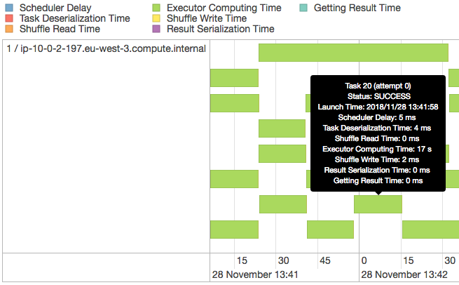

# SE4TeC
## A Scalable engine for Efficient and Expressive Time series Classification

<center>By Jingwei ZUO, Karine ZEITOUNI and Yehia TAHER.</center>

## Outline:

### 1. Cluster_Docker

As we utilize AWS EMR cluster during the test of the project, then we provide an 1-click Spark cluster, powered by Docker, to facilitate the users to simulate the program enviroment locally. The cluster contains the support of PySpark and common Python3 libraries used in this project. Users can modify flexibly the number of slave nodes inside the cluster, and update the support inside each machine instance. 

### 2. Algorithms

We implement all algorithms mentioned in the Paper under Python3.6, which can be distinguished by Centralized Version and Distributed Version. 

### 3. Demo1: Scalability of SE4TeC

In order to show the efficiency and the scalabity of SE4TeC, we give a exploration of our cluster by a video ``` Demo1_scalability.mp4```, where the attendees can get deeper understanding about the distribution mecanism adopted inside our algorithm, as well as the relationship between the cluster capacity and the performance of the program.  
For example, here shows the informations about the tasks distributed in a single executor. As we set 4 CPUs for each executors, then four tasks can run in parallel.
  
The video will show that how we can distribute the algorithm into various computation tasks and allocate them to different nodes/executors.   


  
Figure 1. Stages in a Job
 


  
Figure 2. Jobs in an Application


### 4. GUI - Shapelet Extraction

There are four parts in GUI demonstration for Shapelet Extraction:  

- Distance Profile  
- Matrix Profile   
- Representative Profile/Power  
- Discriminative Profile/Power
